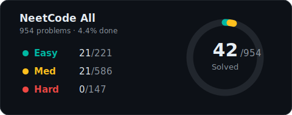
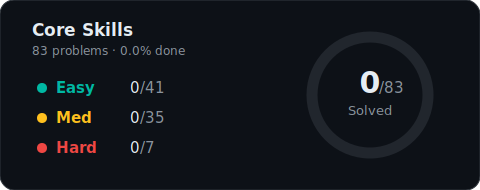

# NeetCode Grind 🧠

> _"A journey of 954 problems begins with a single `console.log('hello world')`"_
> — Ancient LeetCode Proverb (that I just made up)

One dev. JavaScript. An ungodly mass of LeetCode problems standing between me and... well, I'm not sure what. Enlightenment? A FAANG offer? The ability to reverse a linked list at a dinner party?

This repo tracks my slow, painful march through [NeetCode](https://neetcode.io)'s **NeetCode All** (954 problemsa) and **Core Skills** (83 problems). The plan is deceptively simple: solve a bit every day, commit the evidence, and try not to cry when I hit dynamic programming.

---

## 📊 The Scoreboard of Shame

<!-- PROGRESS:START -->
<div align="center">
<br>




<br>

*If this was a marathon, we'd still be stretching in the parking lot.*

</div>

### 🗺️ Territory Explored

| Topic | Easy | Med | Hard | Total |
|:------|:----:|:---:|:----:|:-----:|
| Two Pointers | 10 | 5 | — | **15** |
| Arrays & Hashing | 5 | 7 | — | **12** |
| Sliding Window | 2 | 4 | — | **6** |
| Stack | 1 | — | — | **1** |

<!-- PROGRESS:END -->

---

## 📂 Repo Structure

```
├── Core Skills/              # The 83-problem warm-up (lol "warm-up")
│   └── {Topic}/
│       └── {easy,medium,hard}/
│           └── Problem Name/
│               ├── solution.js
│               └── README.txt
│
├── NeetCode All/             # The full 954-problem gauntlet
│   └── {Topic}/
│       └── {easy,medium,hard}/
│           └── Problem Name/
│               ├── solution.js
│               └── README.txt
│
└── scripts/
    └── update-readme.js      # The one thing I've actually automated
```

## 🔄 Updating Progress

After solving a problem (or staring at one for 45 minutes and then looking up the solution — no judgment), run:

```bash
node scripts/update-readme.js
```

This scans the repo, counts solved problems, regenerates the fancy SVG charts above, and updates this README. It's the most satisfying part of the whole process, honestly.

## 🎯 The Plan™

- [x] Set up the repo
- [x] Solve first problem
- [x] Build a README instead of actually solving problems _(you are here)_
- [ ] Complete Core Skills (83 problems)
- [ ] Complete NeetCode All (954 problems)
- [ ] Touch grass

## 📜 Rules of Engagement

1. **Language:** JavaScript — because apparently I enjoy `undefined` behaviour in life too.
2. **No copy-paste.** Reading solutions after struggling is fine. Ctrl+C is not.
3. **Commit often.** Every solved problem gets committed. Future me will thank present me. Or roast me. Either way, there'll be a git log.
4. **One problem a day** keeps the impostor syndrome at... who am I kidding, it never leaves.

---

<div align="center">

_Started: March 2026 · ETA: TBD (the "T" stands for "thermodynamic heat death of the universe")_

_If you're also grinding NeetCode, godspeed. We're all in this together. Alone. At 2 AM._

</div>
